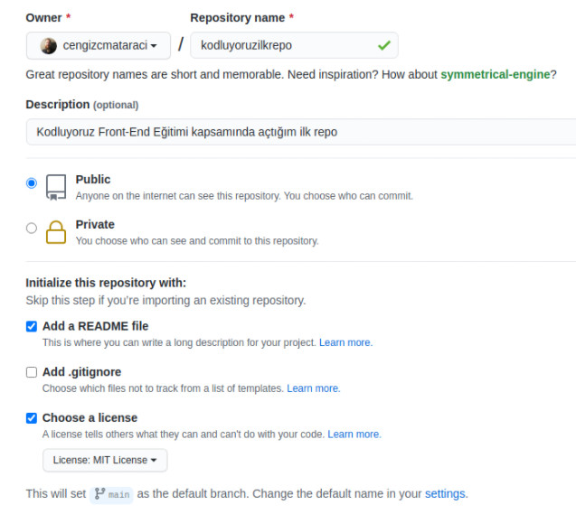

# kodluyoruzilkrepo
Kodluyoruz Eğitimi kapsamında açtığım ilk repo

# Kodluyoruz Ilk Repo

Bu repo [Kodluyoruz](http://kodluyoruz.org) Front-End eğitiminde oluşturduğumuz ilk repo. İçerisinde bir adet README dosyası, bir adet de index.html dosyası barındırıyor.




## Installation

Öncelikle projeyi clonelayın.

```
git clone https://github.com/cengiztt/kodluyoruzilkrepo.git
```

## Usage

Projeyi cloneladıktan sonra Visual Studio Code programında açınız.

Linux için:

```
cd kodluyoruzilkrepo
code.
```

## Contributing

Pull requestler kabul edilir. Büyük değişiklikler için, lütfen önce neyi değiştirmek istediğinizi tartışmmak için bir konu açınız.

## License

[MIT](https://choosealicense.com/licenses/mit/)
